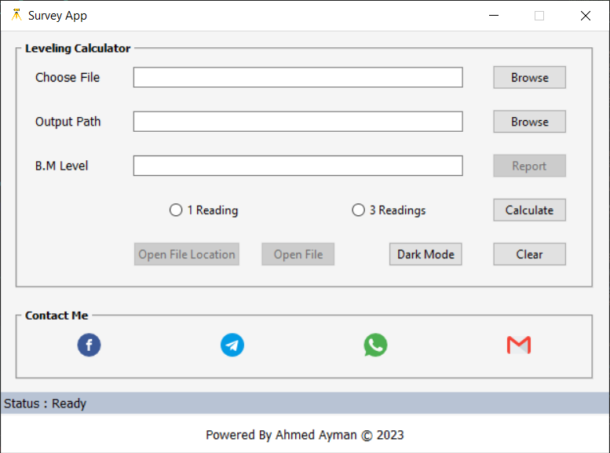
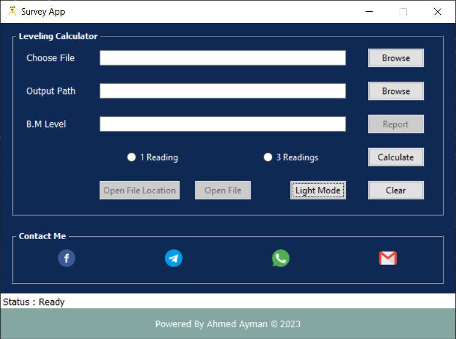

# Leveling Application

This application is designed to solve leveling problems (BS-IS-FS) for both cases 1 or 3 reading/s depending on the user's preference.

#### Note
- The application is still in development.

### Features:

- Solves for either one or three readings.
- User-friendly interface.
- Check all rows and warn you if the input data is not logic.
- Accurate and reliable results.
- Generate report after calculation.
- Log file to track errors or mistakes.
- Light / Dark Mode.

### Interface

>Light Mode 

>Dark Mode

### Usage

1. Enter the required excel file path for your leveling problem.

2. Select output file path.

3. Enter the bench mark level 

4. Select whether you want to solve for one or three readings.

5. Press the "Calculate" button to get the results.

6. After calculation you can press "Report" to generate report containing arithmetic check and leveling conditions.

### Contributing
Contributions are welcome and encouraged! If you find a bug or would like to add a new feature, please feel free to submit a pull request.
